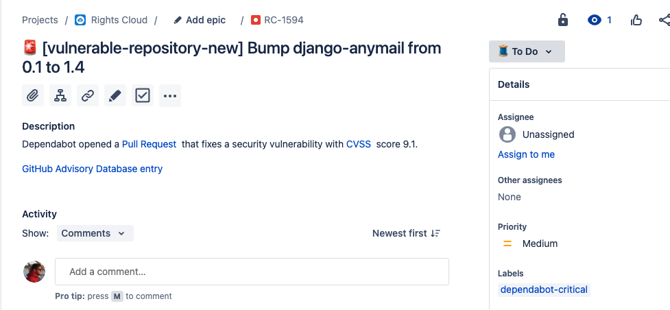

# vulnerable-repository

Demostrates a Github Action that opens a  Jira bug when Dependabot fixes a critical security bug.

## GitHub Action Environment

| Item           | Description                                                                                                                      |
|----------------|----------------------------------------------------------------------------------------------------------------------------------|
| JIRA_BASE_URL  | Your Jira's base url                                                                                                             |
| JIRA_USER_EMAIL| The user that will open the Bug                                                                                                  |
| JIRA_PROJECT   | The target Jira project                                                                                                          |
| JIRA_LABEL     | The label you want to tag the Bug with                                                                                           |
| CVSS_THRESHOLD | The [CVSS](https://en.wikipedia.org/wiki/Common_Vulnerability_Scoring_System) threshold that you want to trigger the bug creation|

## Secrets needed

The repository needs two secrets, the `PAT_TOKEN` which is a
[Github Access Token](https://docs.github.com/en/authentication/keeping-your-account-and-data-secure/creating-a-personal-access-token)
with the `repo.public_repo` scope and the `JIRA_API_TOKEN` which is a [Jira API Token](https://id.atlassian.com/manage-profile/security/api-tokens).

## Sample Jira Bug

